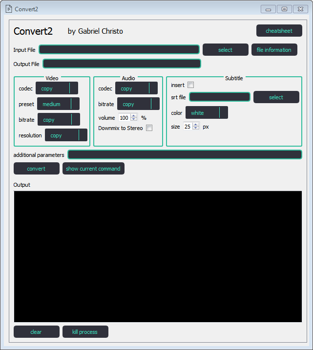

## convert2 Tool ##

A graphical wrapper of some ffmpeg conversion routines

Ensure that you have ffmpeg and ffprobe on your path

You can get it [here](https://ffmpeg.org/download.html)

### Run ###

```
git clone https://github.com/gabrielchristo/convert2.git
pip install -r requirements.txt
python main.py
```

